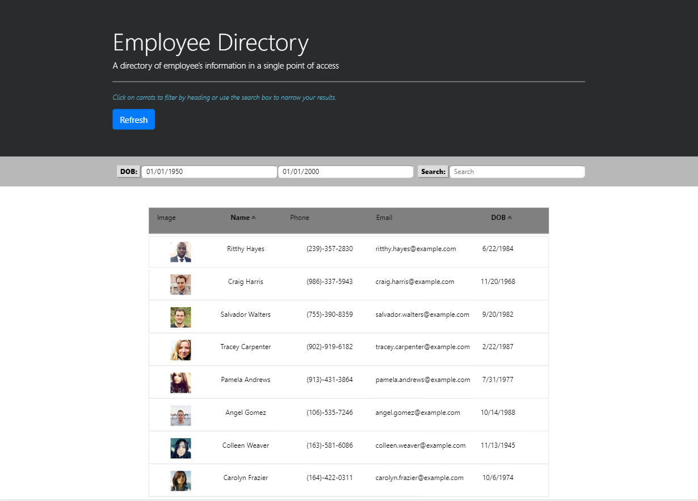

# Employee-Directory-React

- This application uses React to break up the UI into components, manage component state and respond to user events.
- Go to Demo to view a sample video or test the app.

## Table of contents
- [General Info](#Info)
- [Install](#Install)
- [Dependencies](#Dependencies)
- [Technologies](#Technologies)
- [Demo](#Demo)
- [Author](#Author)
- [License](#License)

# General Info
#### User Story
- As a user, I want to be able to view my entire employee directory at once so that I have quick access to their information.

#### Business Context
- An employee or manager would benefit greatly from being able to view non-sensitive data about other employees. It would be particularly helpful to be able to filter employees by name.


# Install
``` bash
    npm i axios
```
``` bash
    npx create-react-app employee-directory-react
```

# Dependencies
``` bash
    "dependencies": {
    "@testing-library/jest-dom": "^4.2.4",
    "@testing-library/react": "^9.5.0",
    "@testing-library/user-event": "^7.2.1",
    "axios": "^0.19.2",
    "react": "^16.13.1",
    "react-dom": "^16.13.1",
    "react-router-dom": "^5.1.2",
    "react-scripts": "3.4.1"
  }
```
``` bash
    "scripts": {
    "start": "react-scripts start",
    "build": "react-scripts build",
    "test": "react-scripts test",
    "eject": "react-scripts eject"
  }
```

In the project directory, you can run:
``` bash
npm start
```
Runs the app in the development mode.
Open http://localhost:3000 to view it in the browser.

The page will reload if you make edits.
You will also see any lint errors in the console.
``` bash
npm test
```
Launches the test runner in the interactive watch mode.
See the section about running tests for more information.
``` bash
npm run build
```
Builds the app for production to the build folder.
It correctly bundles React in production mode and optimizes the build for the best performance.

The build is minified and the filenames include the hashes.
Your app is ready to be deployed!

See the section about deployment for more information.
``` bash
npm run eject
```
Note: this is a one-way operation. Once you eject, you can’t go back!

If you aren’t satisfied with the build tool and configuration choices, you can eject at any time. This command will remove the single build dependency from your project.

Instead, it will copy all the configuration files and the transitive dependencies (webpack, Babel, ESLint, etc) right into your project so you have full control over them. All of the commands except eject will still work, but they will point to the copied scripts so you can tweak them. At this point you’re on your own.

You don’t have to ever use eject. The curated feature set is suitable for small and middle deployments, and you shouldn’t feel obligated to use this feature. However we understand that this tool wouldn’t be useful if you couldn’t customize it when you are ready for it.

# Technologies
- HTML5
- CSS
- jQuery
- Node.js
- React
- Bootstrap
- randomuser.me = API to create fake random employee data

# Demo
Click here to view a <a href="https://drive.google.com/file/d/1DpNywVgTsv-FvtcfkMjL570nDFZcLCim/view"> --> video demo <-- </a>
# Author
- Lloyd Marcelino 
- github: https://github.com/ethanlloyd21
- website: lloydmarcelino.com
- email: lloydmarcelino@gmail.com

# License
- see MIT License Copyright (c) 2020